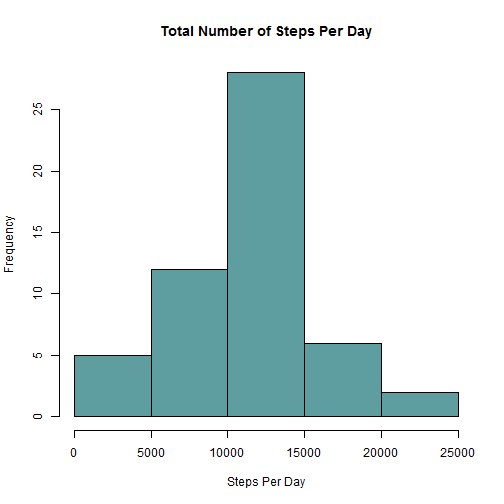
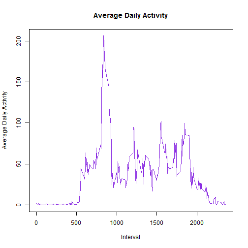
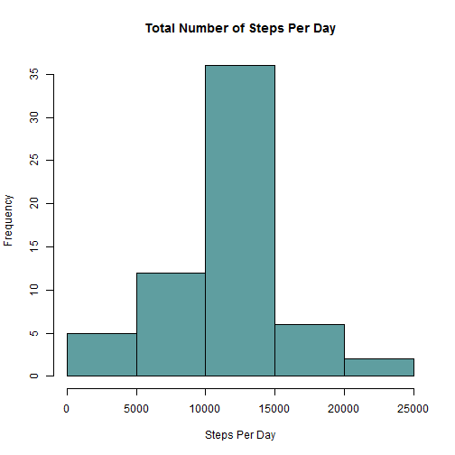
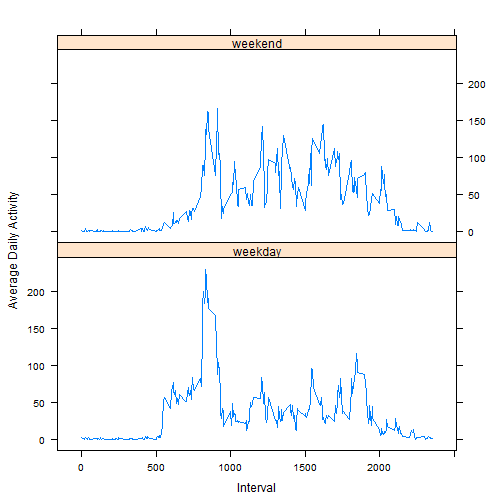

# Reproducible Research: Peer Assessment 1
===========================================


## Loading and preprocessing the data


```r
## Load data and display a summary
dataset <- read.csv("./activity/activity.csv")
```

```r
table1 <- xtable(summary(dataset))
print(table1, type="html")
```

<!-- html table generated in R 3.1.0 by xtable 1.7-3 package -->
<!-- Sun Jul 20 09:42:30 2014 -->
<TABLE border=1>
<TR> <TH>  </TH> <TH>     steps </TH> <TH>         date </TH> <TH>    interval </TH>  </TR>
  <TR> <TD align="right"> 1 </TD> <TD> Min.   :  0.0   </TD> <TD> 2012-10-01:  288   </TD> <TD> Min.   :   0   </TD> </TR>
  <TR> <TD align="right"> 2 </TD> <TD> 1st Qu.:  0.0   </TD> <TD> 2012-10-02:  288   </TD> <TD> 1st Qu.: 589   </TD> </TR>
  <TR> <TD align="right"> 3 </TD> <TD> Median :  0.0   </TD> <TD> 2012-10-03:  288   </TD> <TD> Median :1178   </TD> </TR>
  <TR> <TD align="right"> 4 </TD> <TD> Mean   : 37.4   </TD> <TD> 2012-10-04:  288   </TD> <TD> Mean   :1178   </TD> </TR>
  <TR> <TD align="right"> 5 </TD> <TD> 3rd Qu.: 12.0   </TD> <TD> 2012-10-05:  288   </TD> <TD> 3rd Qu.:1766   </TD> </TR>
  <TR> <TD align="right"> 6 </TD> <TD> Max.   :806.0   </TD> <TD> 2012-10-06:  288   </TD> <TD> Max.   :2355   </TD> </TR>
  <TR> <TD align="right"> 7 </TD> <TD> NA's   :2304   </TD> <TD> (Other)   :15840   </TD> <TD>  </TD> </TR>
   </TABLE>

## What is mean total number of steps taken per day?

```r
## sum all steps for each date and display the distribution
sumsByDate <- with(dataset, aggregate(dataset$steps, list(dataset$date), sum))
hist(sumsByDate$x, xlab = "Steps Per Day", main="Total Number of Steps Per Day", col="cadetblue")
```

 

```r
## calculate the mean and median total number of steps per day
totalStepsPerDayMean <- mean(sumsByDate$x, na.rm=TRUE)
totalStepsPerDayMedian <- median(sumsByDate$x, na.rm=TRUE)
```
The mean and median of the total number of steps per day are: 1.0766 &times; 10<sup>4</sup> and 10765

## What is the average daily activity pattern?

```r
## Calculate the mean of steps for each interval accros all days
meanByInterval <- with(dataset, aggregate(dataset$steps, list(dataset$interval), mean, na.rm = TRUE))
names(meanByInterval) <- c("Interval", "Mean")
## Plot a time seires for the daily pattern of steps
plot(meanByInterval$Interval, meanByInterval$Mean, type="l", ylab = "Average Daily Activity", xlab = "Interval", main="Average Daily Activity", col="blueviolet")
```

 

```r
## Find the interval with the max avarage of steps
maxMeanInterval <- meanByInterval[meanByInterval$Mean == max(meanByInterval$Mean), ]$Interval
```
The interval with the maximum steps on avarage is: 835

## Imputing missing values
In order to impute missing values I replaced them with the mean for the relevant interval.

```r
## Number of missing values in data set
missingValues <- sum(is.na(dataset))
```
There are 2304 in the dataset.


```r
## Replace NAs with interval mean
impute.mean <- function(x) replace(x, is.na(x), mean(x, na.rm = TRUE))
dataset2 <- ddply(dataset, .(interval), transform, steps = impute.mean(steps),date = date,interval = interval)
## reorder dataset2 to match original order
dataset2 <- dataset2[order(dataset2$date, dataset2$interval),]
row.names(dataset2) <- 1:nrow(dataset2)
## sum all steps for each date and display the distribution
sumsByDate2 <- with(dataset2, aggregate(dataset2$steps, list(dataset2$date), sum))
hist(sumsByDate2$x, xlab = "Steps Per Day", main="Total Number of Steps Per Day", col="cadetblue")
```

 

```r
## calculate the mean and median total number of steps per day
totalStepsPerDayMean2 <-mean(sumsByDate2$x, na.rm=TRUE)
totalStepsPerDayMedian2 <- median(sumsByDate2$x, na.rm=TRUE)
```
The mean and median of the total number of steps per day are: 1.0766 &times; 10<sup>4</sup> and 1.0766 &times; 10<sup>4</sup>  
As you can see from the chart this does change somewhat the distribution. If I were to choose to replace the missing values with the daily avarage it would not have change this distribution but would have changed the daily pattern.

## Are there differences in activity patterns between weekdays and weekends?

```r
## Convert date to type date and generate a day type column
dataset2$date <- as.Date(dataset2$date, format = "%Y-%m-%d")
dataset2$weekend <- dataset2$date
transformDayOfWeek <- function(x) { !weekdays(x) %in% c("Saturday","Sunday")}
dataset2 <- transform(dataset2, weekend = transformDayOfWeek(weekend))
dataset2$dayType <- "weekday"
dataset2$dayType[dataset2$weekend == FALSE] <- "weekend"
dataset2$dayType <- as.factor(dataset2$dayType)
## Calculate the mean of steps for each interval accros all days 
meanByIntervalDayType <- aggregate(steps ~ interval + dayType, dataset2, mean)
## Plot a time seires for the daily pattern of steps for weekdays and weekends
xyplot(meanByIntervalDayType$steps ~ meanByIntervalDayType$interval | meanByIntervalDayType$dayType, layout = c(1, 2), type ="l", ylab="Average Daily Activity", xlab="Interval")
```

 

In the plot we see that there are indeed some differences in activity patterns between weekdays and weekends. It looks like on the weekdays the activity starts earlier and then peaks and slows down a bit where on the weekend the activity starts later anhas a higher change rate. 
